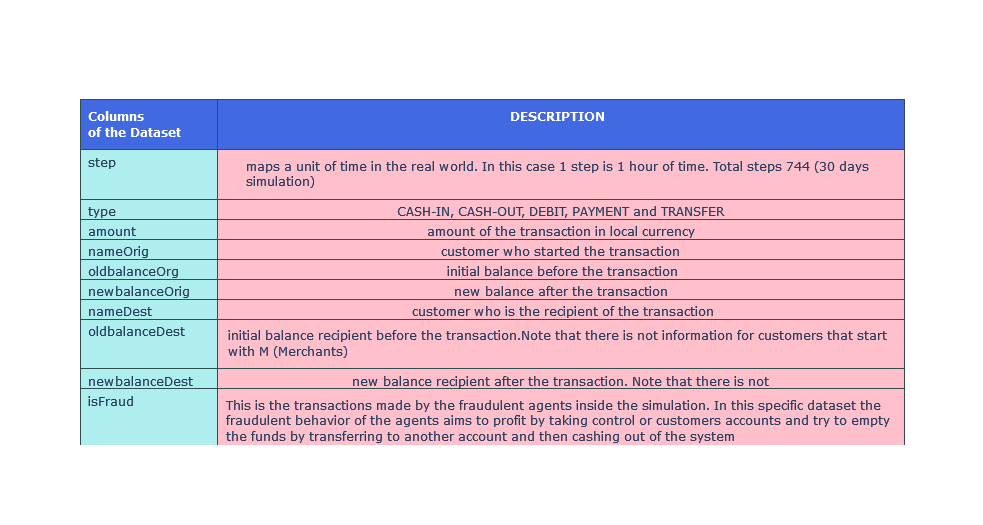
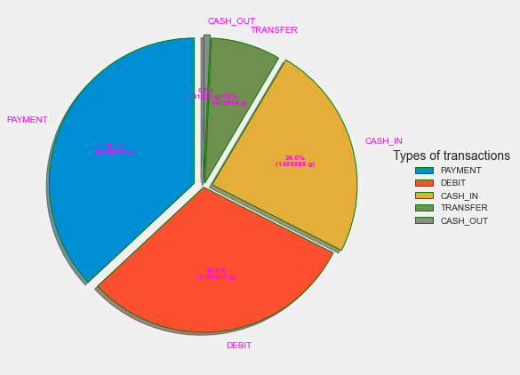
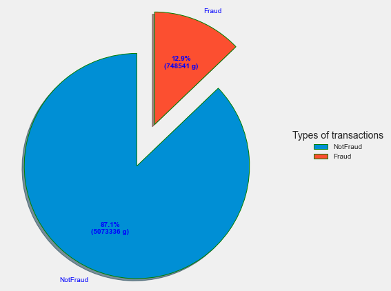
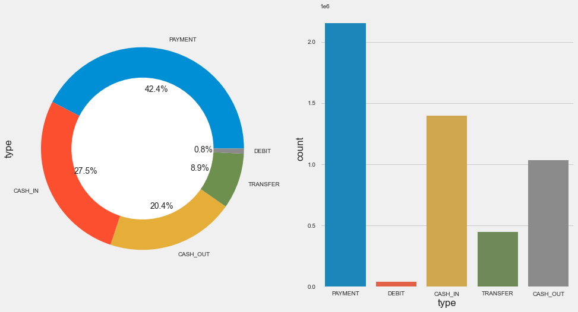
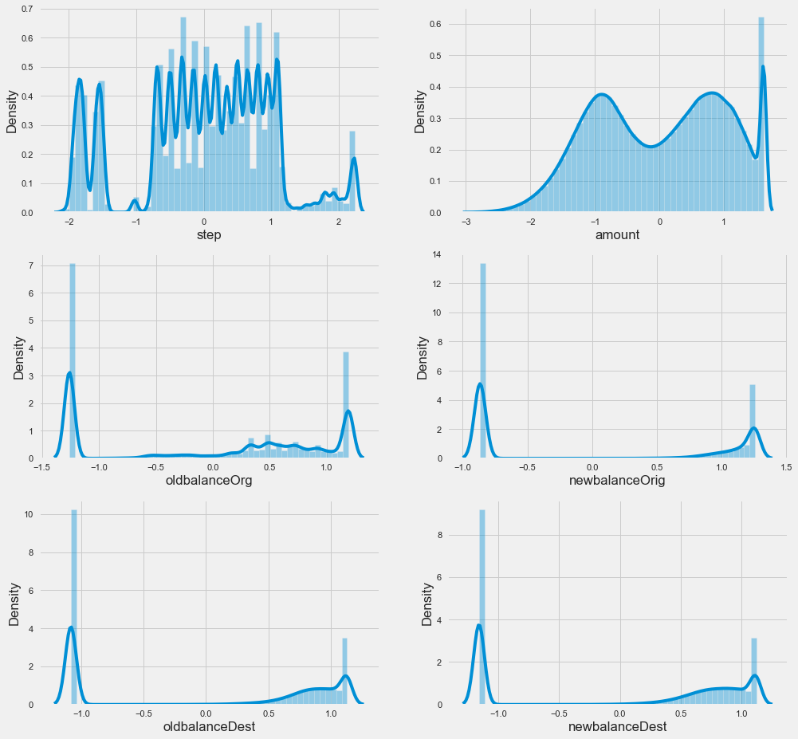
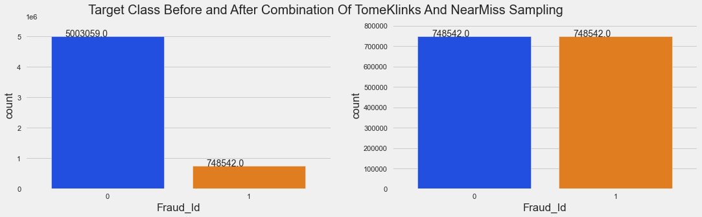
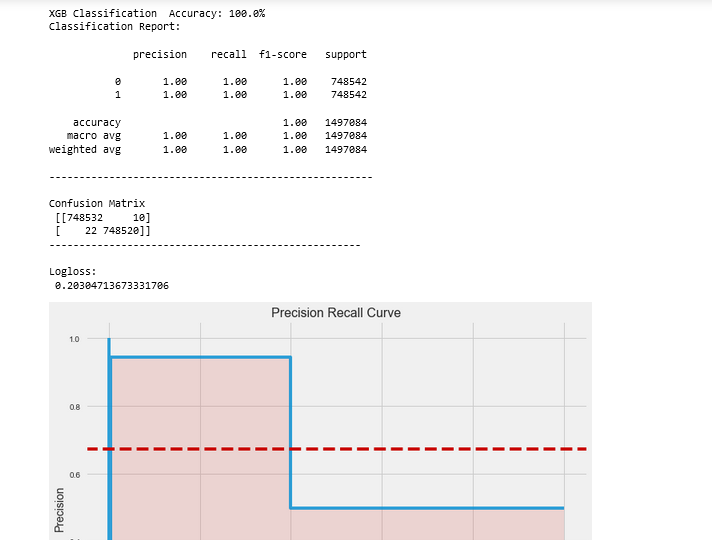
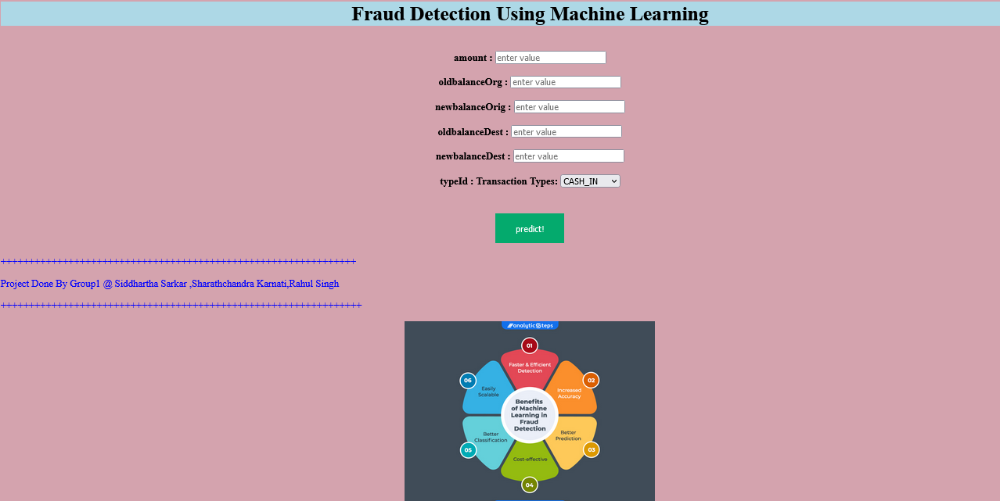
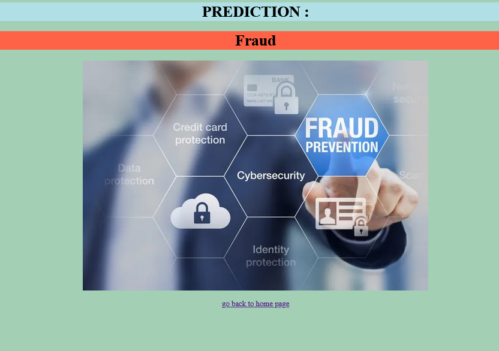
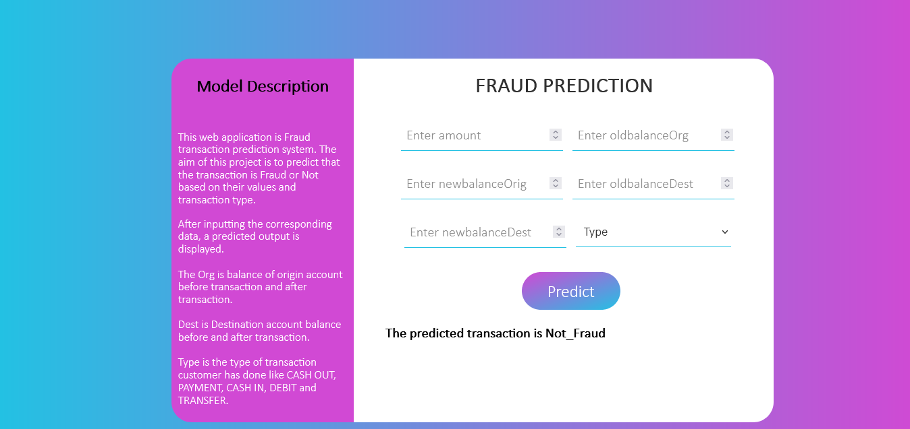

# Fraudulent-Transaction-Predictions
## Fraudulent Transaction Predictions using Machine Learning Algorithms

#### Fraudulent Transaction Classification:

Business Objective

Objective::The Aim of this project is to build a model to predict whether a transaction is fraudulent or not. To predict feature importance which can help in predicting fraud more easily. 

What is fraudulent transactions?

.A fraudulent transaction is the unauthorized use of an individual’s accounts or payment information. Fraudulent transactions can result in the victim’s loss of funds, personal property, or personal information.

.The fraudulent transaction is one of the most serious threats to online security nowadays. Artificial Intelligence is vital for financial risk control in the cloud environment. Many studies attempted to explore methods for online transaction fraud detection; however, the existing methods are insufficient to conduct detection with high precision.

.Fraud prevention is the implementation of a strategy to detect fraudulent transactions or banking actions and prevent these actions from causing financial damage and the reputation of the client and the financial institution.

.There are always financial frauds and They can happen in virtual and physical ways. So the investment in security has been increasing. Keep your business safe from online payment fraud There is no guaranteed method for payment fraud prevention. By taking certain precautions, however, you can minimize the damage they cause and make sure your business has the best chance to thrive despite them.

FRAUDULENT TRANSACTIONS & BUSINESS UNDERSTANDING:

What is Payment Fraud?

Payment fraud is any type of false or illegal transaction completed by a cybercriminal. The perpetrator deprives the victim of funds, personal property, interest, or sensitive information via the Internet. Ecommerce businesses rely on electronic transactions to charge customers for products and services. The increased volume of electronic transactions has also resulted in an increase in fraudulent activities.

Types of fraud:-

=>Business credit card fraud
=>Wire fraud
=>ACH fraud
=>Forgery
=>Invoice fraud
=>Phishing
=>Identity theft
=>Pagejacking
=>Merchant identity fraud

#### From Eda Analysis ,we came to know that the target column is not Properly Captured ,contains lots of Mis-Classifications,so we tried to fix it ,using Manual technique...

### Different mode of transaction types:

PAYMENT - Payment is like when we pay to any merchant or to any customer by way of digital transactions like UPI. In our dataset we have been given Payment details of only merchants and they are not provide with any account balance details. So, without knowing the balance details we are not sure that the transactions is Fraud or not. So, we will just drop these transactions as they are no use to us for modeling.

CASH IN - It happen when cash is deposited to someones account and his account balance gets increase. CASH IN affect only the origin account and not the destination account if that happen than those transaction will be termed as transfer not cash in. CASH IN only deals with origin account as it affect only the amount of origin account. It increases the balance at origin account. The bank do not consider CASH IN as a fraud because it is fully under the conscience of the customer and not the bank. And we are also not given with any details on how to set fraud, so we will just use the bank domain knowledge and will drop these type of transactions.

DEBIT - A bank debit occurs when a bank customer uses the funds in their account, therefore reducing their account balance. Bank debits can be the result of checque payments, honored drafts, the withdrawal of funds from an account at a bank branch or via ATM, or the use of a debit card for merchant payments. So, withdraw of funds here is separated with CASH OUT, merchant payments is separated as PAYMENT. We are left with cheque payments and honored drafts, these both transactions are under the will of customer. Debit here only affect the origin account. Bank deals with these transaction as under the conscience of the sender. So, we can also drop these transactions as they cannot leads to Fraud.

CASH OUT - Fraudulent cash-out refers to the withdrawal of cash from a card through a fake purchase transaction that bypasses the interest charges and credit limits of cash advances set by the issuing bank. CASH OUT only deals with origin account. It helps the fraudster to cash out the money, they always try to drain out the account balance. we will take these transactions as fraud because they are draining the origin account balance and cashing out from the system. Same amount is being transfer and cash out.

TRANSFER - In a money transfer fraud, the fraudster will approach you via email, call, WhatsApp or SMS and will lure you to access malicious links for making payments. These fake bank URLs will look almost identical to the original URL which makes it difficult to identify in first glance if you are not careful. An authorised push payment (APP) scam, also known as a bank transfer scam, occurs when you - knowingly or unwittingly - transfer money from your own bank account to one belonging to a scammer. Here also scammer transfer the amount and cash out.

Fraud Can happen mostly on financial transactions from your account and without your knowledge. It occurs when a criminal gains access to your card number—and in some cases, personal identification number to make unauthorized purchases or withdraw cash from your account. So, these type of transactions can only happen under TRANSFER and CASH OUT.

So, From above details we can conclude that FRAUD mostly happen under CASH out and TRANSFER. Our focus will be to check fraud under these type of transactions.
## About Dataset

## Different types of Transaction modes

## Percentages oof classes in the Target Columns

## Plots

## BAr Plot after under sampling using TomKlinks and NearMiss Intregation ..

## Final Model Performance

# Deployment:
## Version1:

## Version2: Final App->

